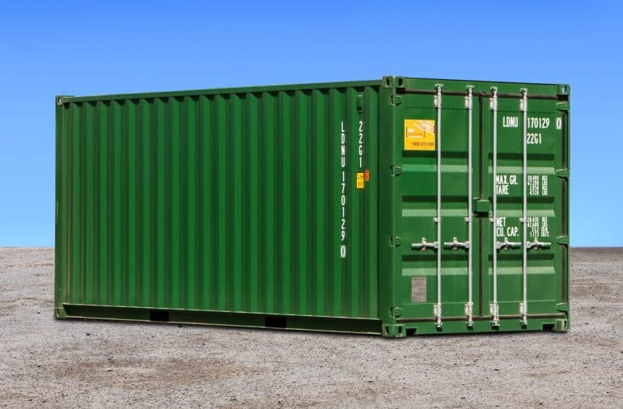

## C-Container

Simple containerisation experiment using Linux features.

## How it works

Using linux namespaces we can create the illusion that a process is isolated & alone on its host. Here we launch a thread with the `clone(2)` call, passing in namespace flags. This runs the thread within new namespaces, masking all processes in the parent namespace.

By changing the root of the process to a mockup Ubuntu filesystem, and mounting the `/proc` directory, we can hide all other processes on the host.

## Use

- Linux only -- namespaces aren't supported elsewhere
- Try `./build_and_run.sh run /bin/bash` to launch the container with an interactive shell

## Scripts

- you'll need to `chmod +x script_name.sh` to add permissions for each to be executed

- gcc_install: You need gcc to build_and_run. This script installs it.

- download_img_base: Pulls a base Ubuntu filesystem for constructing our container image.

- build_and_run: Compiles, and runs if compile success. Passes through your command line args.

- docker_run: Launches a Docker container with Ubuntu, and mounts this project inside. This allows
us to change & test system settings without worrying about doing damage.

- change_dir: a utility for making sure we execute in the correct container

## Reference

- clone(2): http://man7.org/linux/man-pages/man2/clone.2.html
- namespaces(7): http://man7.org/linux/man-pages/man7/namespaces.7.html
- cgroups(7): http://man7.org/linux/man-pages/man7/cgroups.7.html

## TODO

- CGroups
- User & Network namespaces
